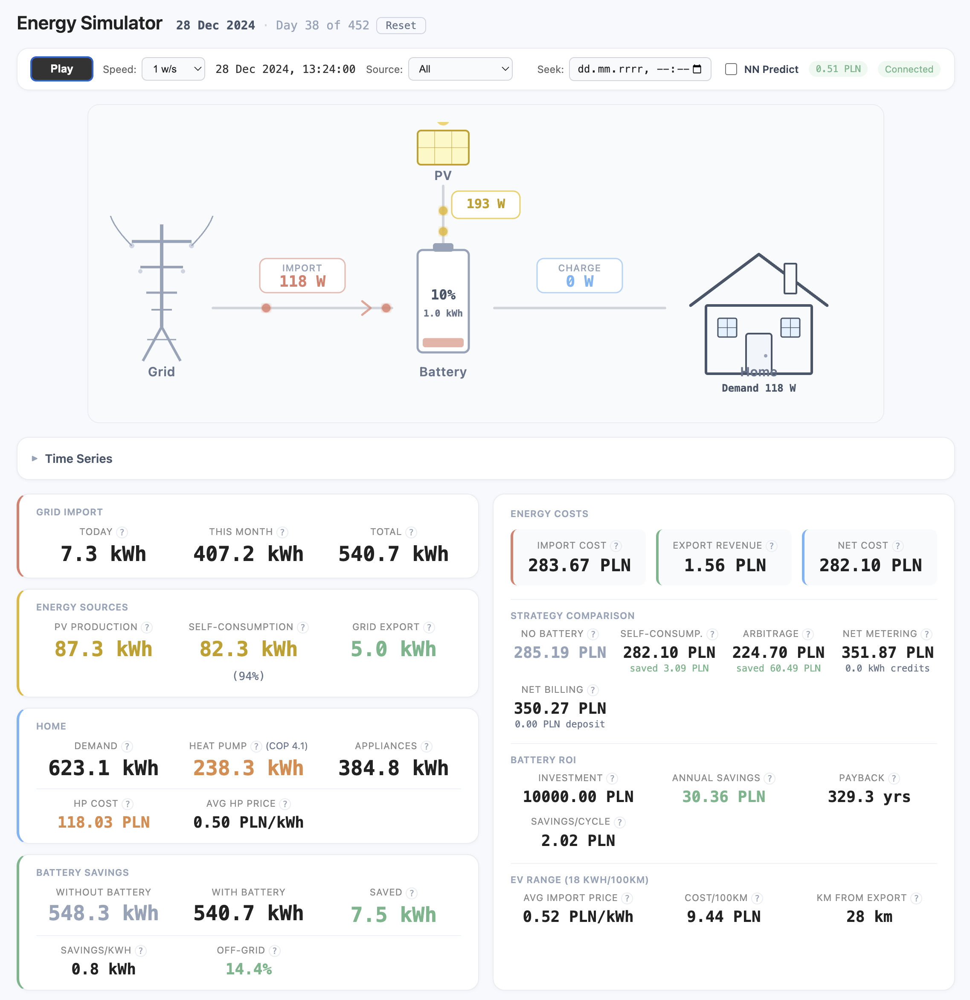

# Energy Simulator

Home energy simulator that replays historical sensor data through a WebSocket-driven dashboard. Visualize grid power, solar generation, heat pump operation, and individual appliance consumption with realistic time-accelerated playback.



## Quick Start

```bash
make dev              # backend :8080 + frontend :5173
# or
docker compose up     # production build on :8080
```

## Data Setup

The simulator needs CSV data in the `input/` directory. See `input.sample/` for example files in all supported formats.

```bash
cp -r input.sample/ input/      # start with sample data
```

For real data, populate these directories:

| Directory        | Format                  | Description                              |
|------------------|-------------------------|------------------------------------------|
| `input/`         | Legacy per-sensor CSV   | One file per sensor (e.g. `grid_power.csv`) |
| `input/stats/`   | Multi-sensor statistics | Hourly aggregates from Home Assistant    |
| `input/recent/`  | Multi-sensor recent     | Recent readings, spot prices             |

To fetch data directly from Home Assistant:

```bash
cp .env.sample .env          # add your HA_URL and HA_TOKEN
make ha-fetch-history        # fetches all available sensor history
```

The tool writes weekly CSV files (e.g. `2026-W07.csv`) to `input/recent/`. Run it repeatedly — it only fetches new data and backfills older data automatically.

### Automatic Periodic Fetching (macOS)

To keep data up to date automatically, set up a launchd job (macOS's native scheduler — works reliably with laptop sleep/wake):

```bash
# 1. Build the binary
make build-ha-fetch-history

# 2. Create a launchd plist
cat > ~/Library/LaunchAgents/com.energy-simulator.ha-fetch.plist << 'EOF'
<?xml version="1.0" encoding="UTF-8"?>
<!DOCTYPE plist PUBLIC "-//Apple//DTD PLIST 1.0//EN" "http://www.apple.com/DTDs/PropertyList-1.0.dtd">
<plist version="1.0">
<dict>
    <key>Label</key>
    <string>com.energy-simulator.ha-fetch</string>
    <key>ProgramArguments</key>
    <array>
        <string>/Users/olek/projects/llm/energy_simulator/bin/ha-fetch-history</string>
        <string>-output</string>
        <string>/Users/olek/projects/llm/energy_simulator/input/recent</string>
    </array>
    <key>WorkingDirectory</key>
    <string>/Users/olek/projects/llm/energy_simulator</string>
    <key>StartInterval</key>
    <integer>3600</integer>
    <key>StandardOutPath</key>
    <string>/tmp/ha-fetch.log</string>
    <key>StandardErrorPath</key>
    <string>/tmp/ha-fetch.log</string>
    <key>EnvironmentVariables</key>
    <dict>
        <key>HOME</key>
        <string>/Users/olek</string>
    </dict>
</dict>
</plist>
EOF

# 3. Load the job (runs every hour)
launchctl load ~/Library/LaunchAgents/com.energy-simulator.ha-fetch.plist

# Check status
launchctl list | grep ha-fetch

# View logs
tail -f /tmp/ha-fetch.log

# To stop
launchctl unload ~/Library/LaunchAgents/com.energy-simulator.ha-fetch.plist
```

The tool reads `.env` for `HA_URL` and `HA_TOKEN`. Adjust `StartInterval` (seconds) to change frequency — 3600 = hourly, 21600 = every 6 hours.

See [`input/README.md`](input/README.md) for format details and sensor type reference.

## Features

- **Real-time replay** of historical energy data at configurable speed (1s to 1 month per second)
- **Live power flow diagram** showing grid, PV, battery, and home consumption with animated energy dots
- **Battery simulation** with configurable capacity, power, SoC limits, and degradation modeling
- **Dual strategy comparison**: self-consumption vs. price arbitrage (when spot price data available)
- **Cost tracking**: spot pricing, net metering, net billing, battery ROI calculator
- **Heat pump analysis**: COP tracking, consumption cost at spot price, avg HP electricity price
- **Pre-heating simulation**: thermal mass shadow model comparing actual HP cost vs optimal pre-heat/coast strategy
- **Seasonal heating analysis** with monthly COP breakdown and consumption anomaly detection
- **Load shifting dashboard**: day-of-week × hour heatmap, HP timing efficiency, shift potential
- **PV multi-orientation modeling**: data-derived profiles, configurable East/South/West arrays, per-array production
- **Multi-series time-series chart** with togglable grid, PV, battery, heat pump, price, SoC, and temperature layers
- **Neural network prediction** of temperature and grid power for synthetic data generation
- **Heatmaps** for battery state-of-charge (teal gradient) and off-grid autonomy (amber→blue)
- **HTML export** of full simulation report (energy, costs, arbitrage log, daily records)
- **Load analysis CLI** for COP curves, hourly cost distribution, and shift potential
- **HA data fetch** tool for incremental sensor history download with weekly CSV output

## Make Targets

```
Development:
  make dev                backend + frontend with hot reload
  make dev-backend        backend only (air file watcher)
  make dev-frontend       frontend only (vite dev server)

Building:
  make build              build backend binary + frontend static assets
  make build-backend      Go binary → bin/server
  make build-frontend     static site → frontend/build/

Testing:
  make test               all tests (Go + frontend)
  make test-backend       Go tests
  make test-backend-v     Go tests (verbose)
  make test-frontend      vitest

Linting:
  make lint               all linters
  make lint-backend       go vet
  make lint-frontend      eslint + prettier

Neural Networks:
  make train              train temperature + grid power models
  make sample-predict     generate predictions (temp NN → power NN)

Data & Analysis:
  make ha-fetch-history   fetch sensor history from Home Assistant REST API
  make fetch-prices       download historic spot prices to input/recent/
  make load-analysis      COP curves, hourly cost distribution, shift potential
  make compare            battery configuration comparison
  make sql-stats          print SQL for Home Assistant DB queries

Docker:
  docker compose up       production build on :8080
  make clean              remove build artifacts
```

## Tech Stack

- **Backend:** Go 1.25, `net/http` + `gorilla/websocket`
- **Frontend:** Svelte 5, SvelteKit, layerchart, D3
- **Communication:** WebSocket (no REST API)
- **Testing:** Go `testify`, vitest + `@testing-library/svelte`

## License

[GPLv3](LICENSE)
