# Part I — Solar & Grid Sizing

The original question: are hourly averages sufficient for sizing inverters,
batteries, and wiring? No. Peak power within each hour is systematically
higher, and the gap has financial consequences.

## Grid Power Pattern

Average grid power follows a predictable pattern: import in the morning and
evening, export during midday solar hours.

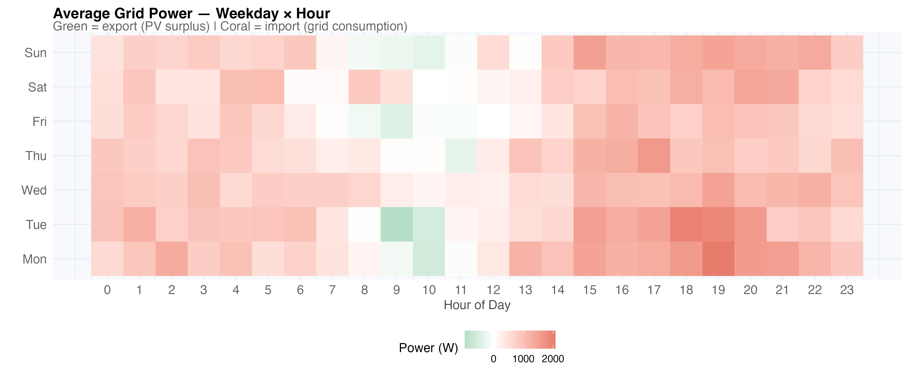

But averages hide the variance within each hour.

## Peaks vs Averages

Every hour plotted as (average, peak). All points above the 1:1 line — nearly
all of them — show where peak exceeded average:

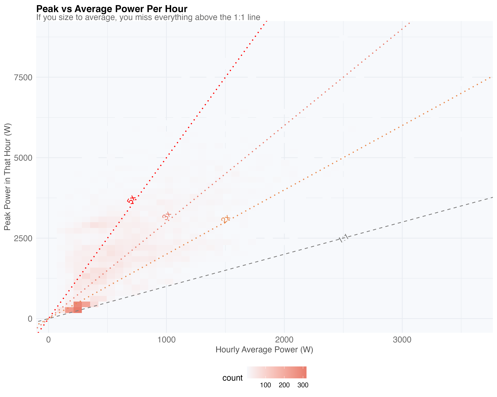

The typical peak/average ratio is ~1.8x:

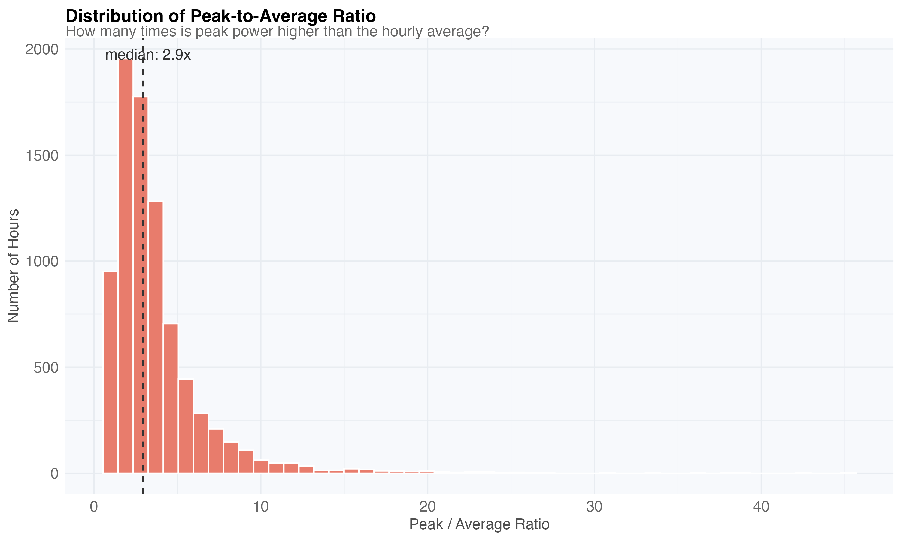

Sizing an inverter to hourly averages (green) leaves peaks uncovered. Covering
95% of actual demand (red) requires significantly more:

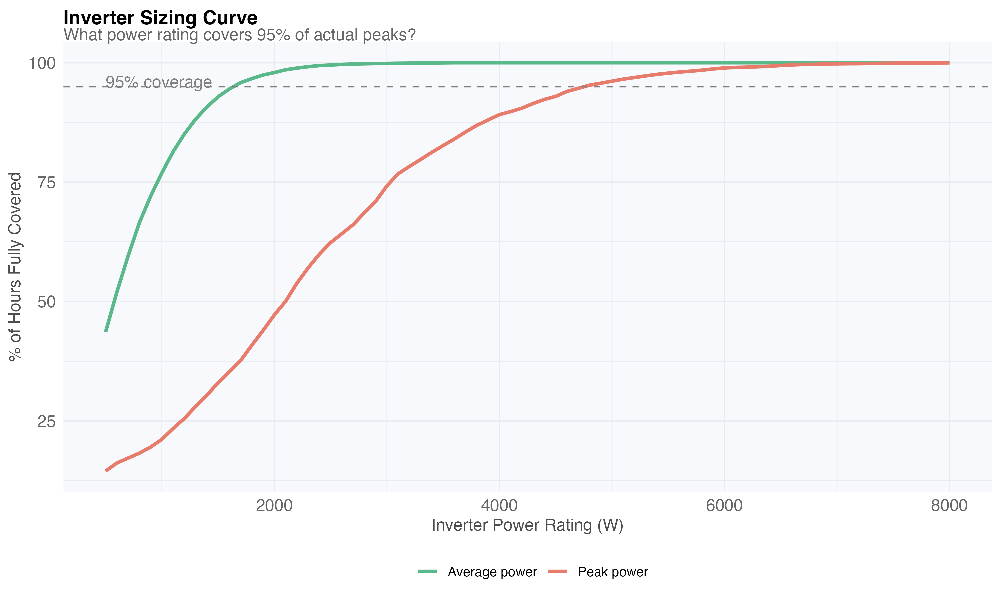

The gap between average and peak is worst at midday (solar fluctuations) and
evening (cooking + heating):

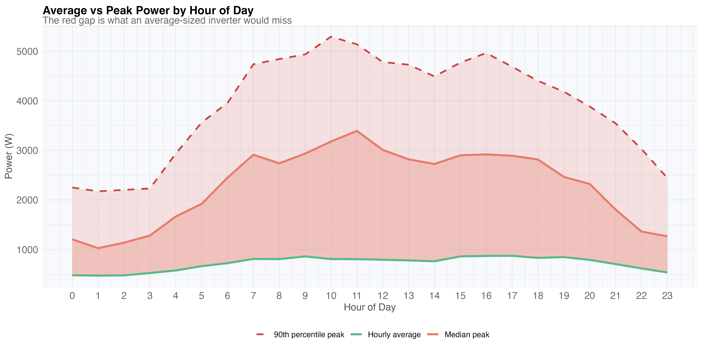

## Hidden PV Generation

~30% of "import" hours actually contain moments of solar export. Hourly
averaging cancels out these brief bursts:

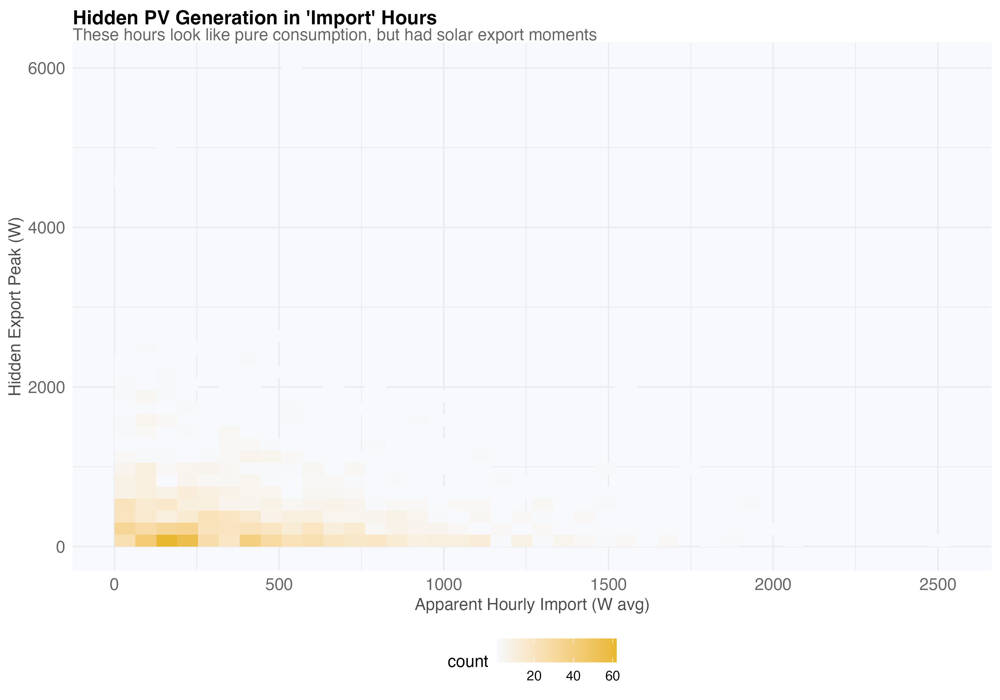

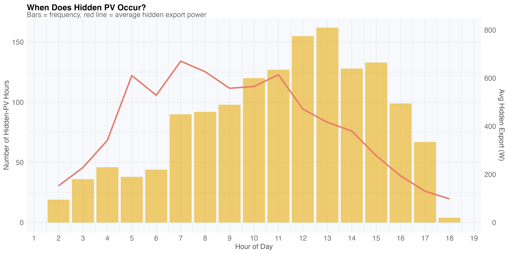

A single day shows how much the average conceals vs the actual min-max range:

## Power Duration Curves

Extreme peaks (>5 kW) occur only a few percent of the time. Import vs export
overlaid shows which drives inverter sizing:

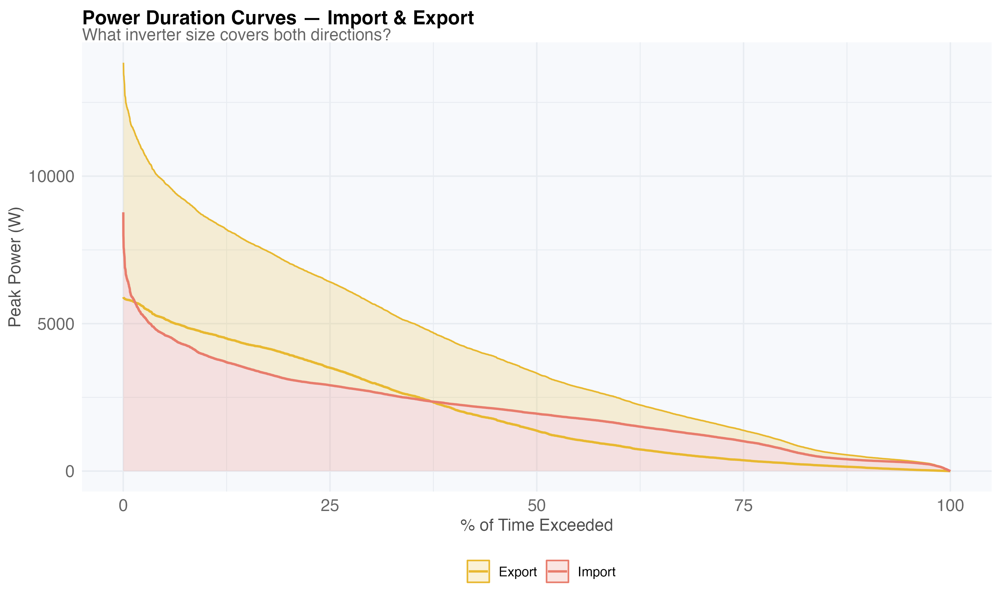

## Export Clipping

When the inverter caps export power, excess PV is wasted. Diminishing returns
as inverter size increases:

## Seasonal Variation

Winter drives inverter sizing more than summer — high heating demand creates
the largest peaks:

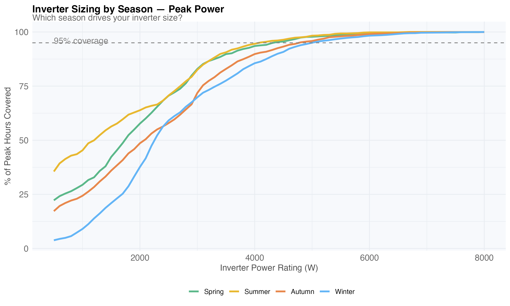

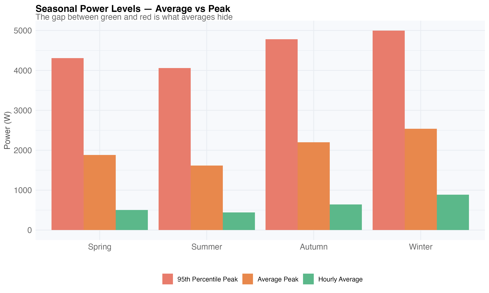

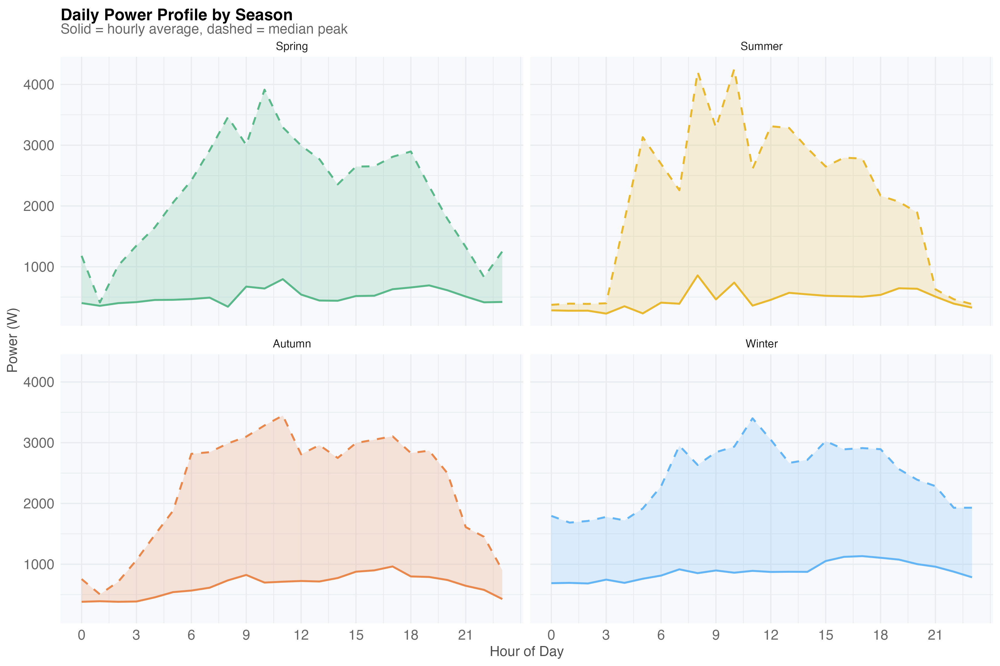

## Financial Impact of Undersizing

Monetary cost of clipping at each inverter size, using real spot prices:

High-price evening peaks are the most expensive to clip:

Each additional kW of inverter capacity saves less than the previous one:

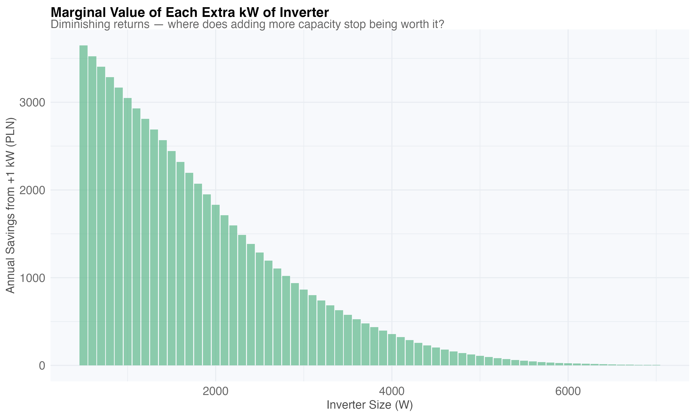
