# Part II — Solar Economy

How solar generation, spot prices, and load patterns interact to determine
the economic value of PV and battery systems.

## Spot Price Patterns

Eight years of spot price data (2018-2026) — the 2022 energy crisis is
clearly visible:

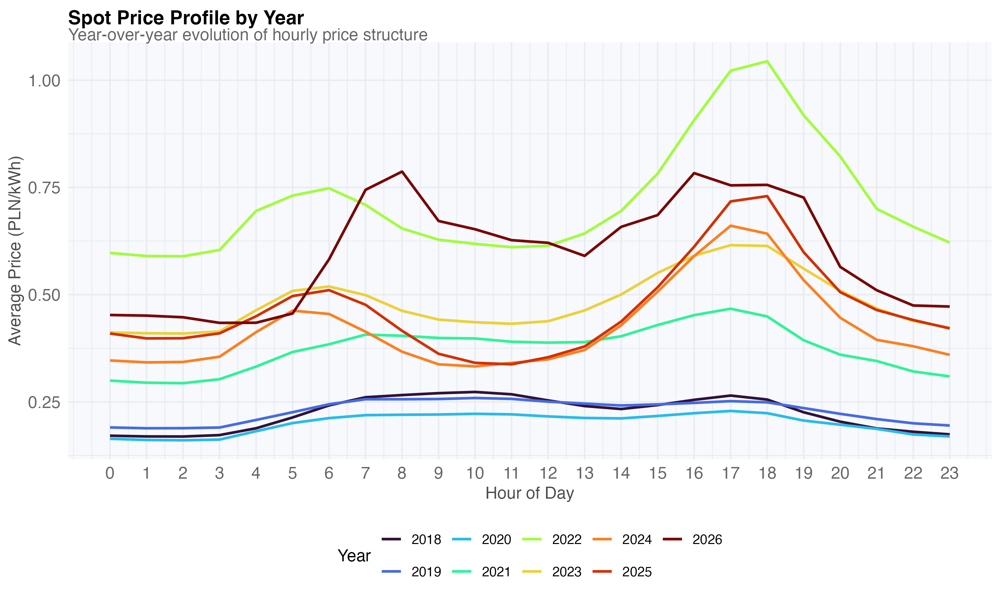

Daily price volatility (max/min ratio) determines arbitrage and load-shifting
potential:

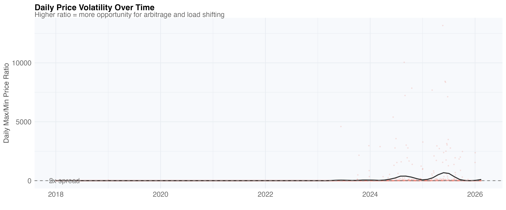

## PV Self-Consumption

How much solar generation is used directly vs exported:

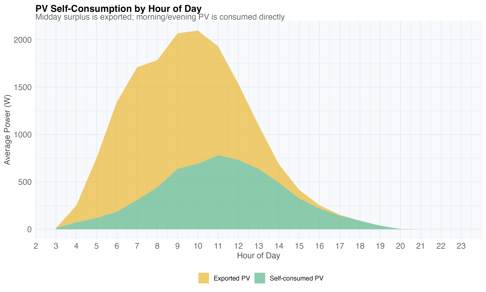

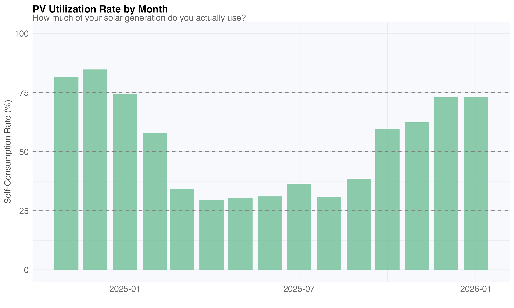

## Self-Sufficiency

A self-sufficient hour draws no grid power. Overall: 22.8% of hours, peaking
at 47% in June:

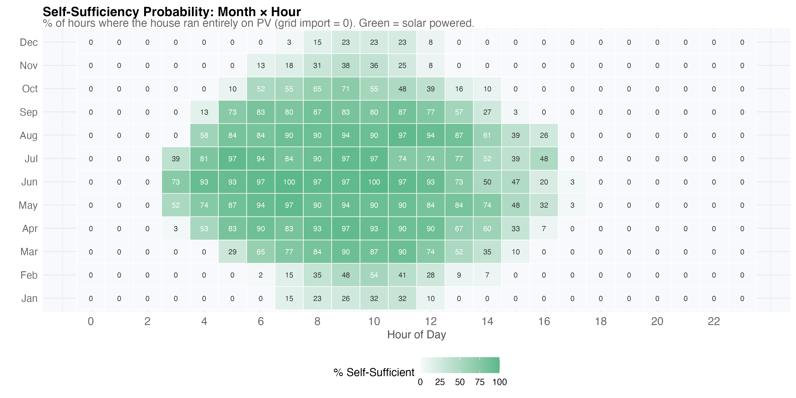

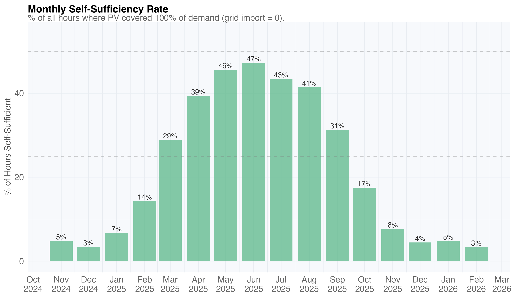

Daily self-sufficiency rate (daytime hours, 6-20h):

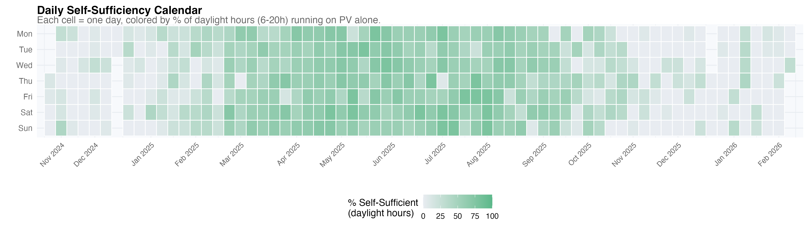

## Appliance vs PV Timing

Do major appliances run during solar hours? Washing machine already 37%
solar-covered, oven 21%:

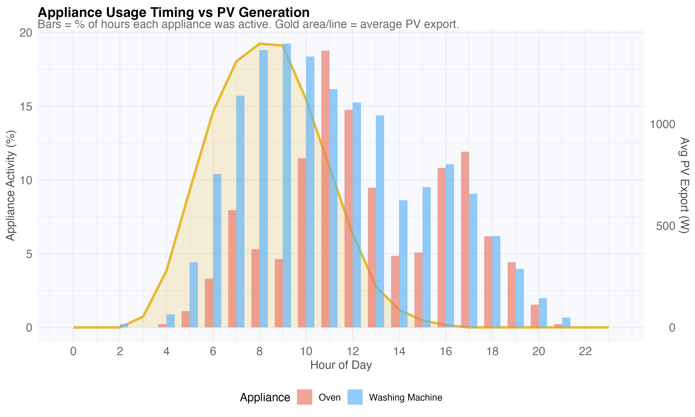

Shifting all runs to PV peak hours (10-14h) would save ~35 PLN/year:

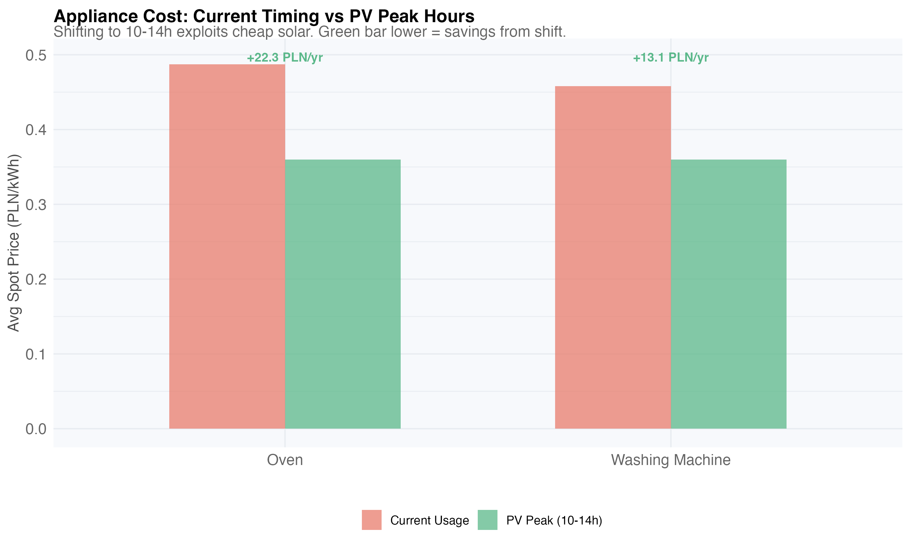

## Battery Self-Sufficiency

Simulated battery at each capacity. Steep initial rise, then diminishing returns:

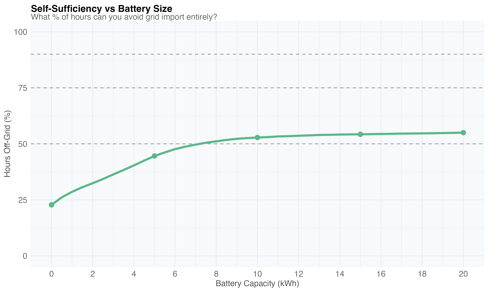

## Battery Temperature Feasibility

Can LFP batteries survive year-round in an unheated workshop (metal garage)?
Charge limit: 0°C, discharge limit: -10°C.

With light insulation + battery waste heat (300W) + 50W heating pad, no-charge
days drop from 108 to 12 — just 2% of the year:

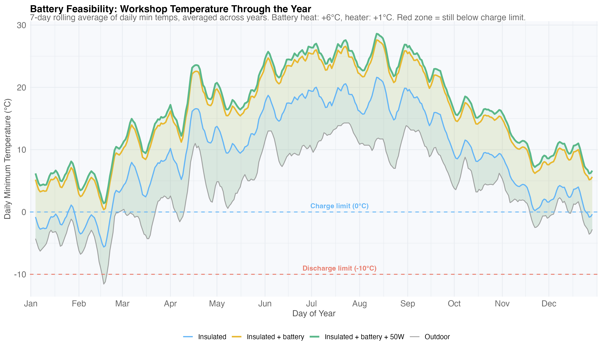

PV surplus lost because the battery is too cold to charge — negligible with
insulation:

## Baseload

The always-on power floor — fridge, network, standby devices:

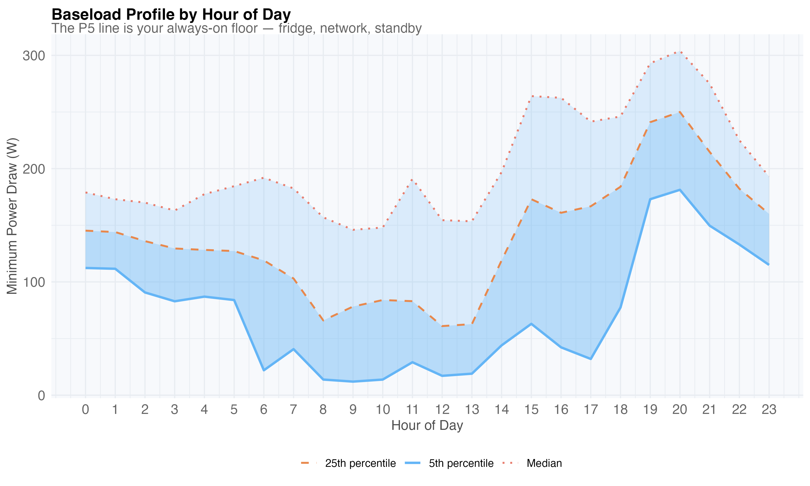

## Appliance Load Shifting

Washing machine, drier, and oven usage overlaid with spot prices:

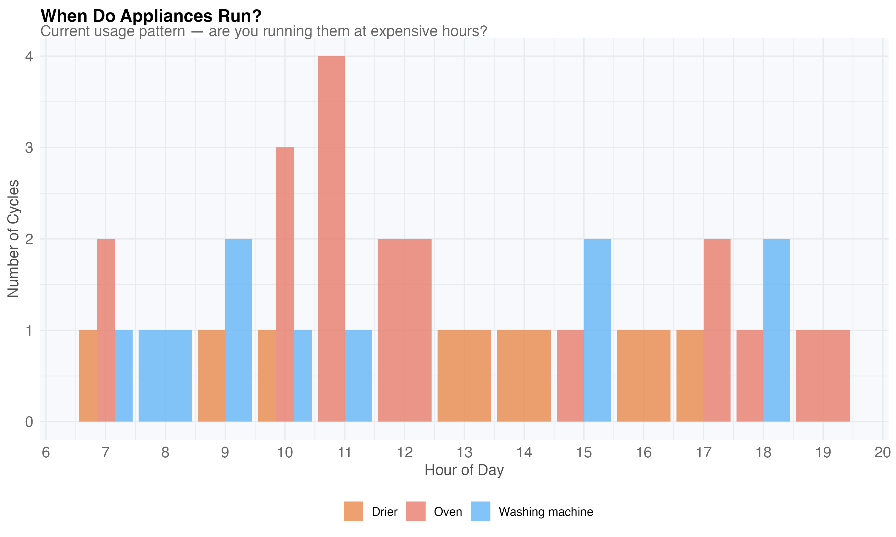

