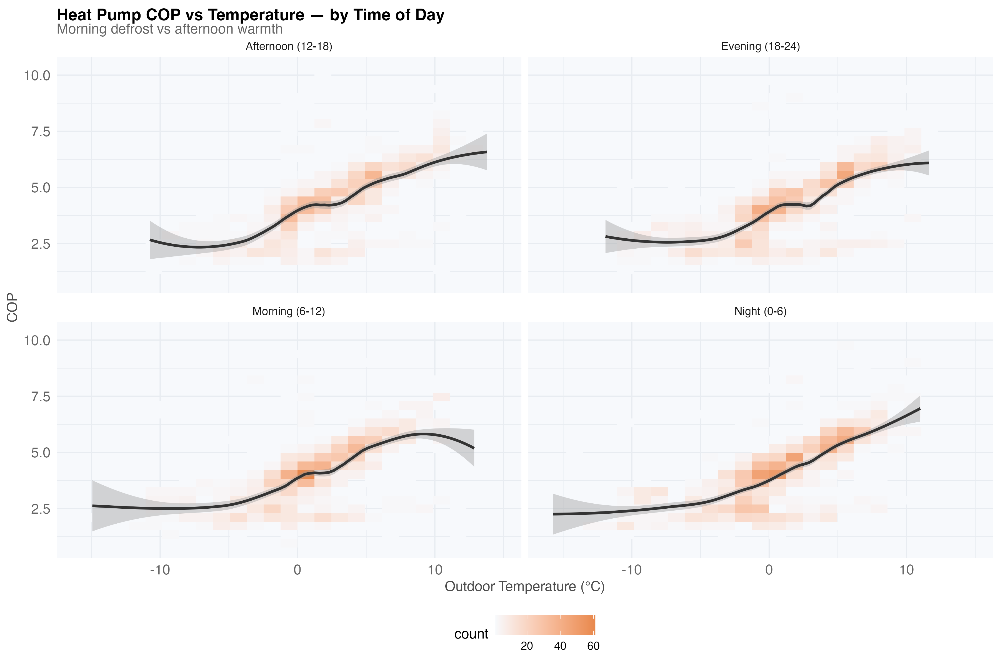
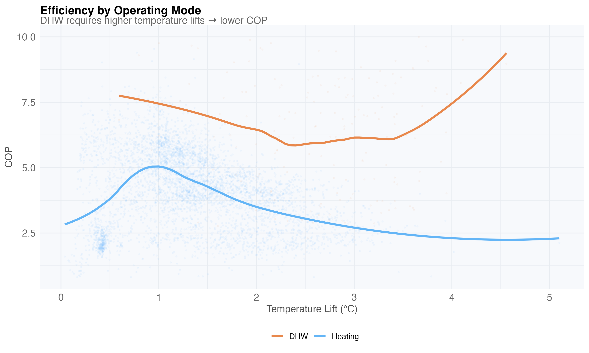
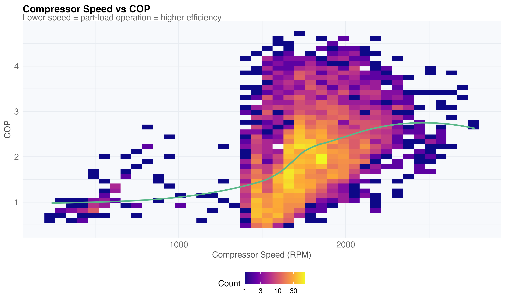
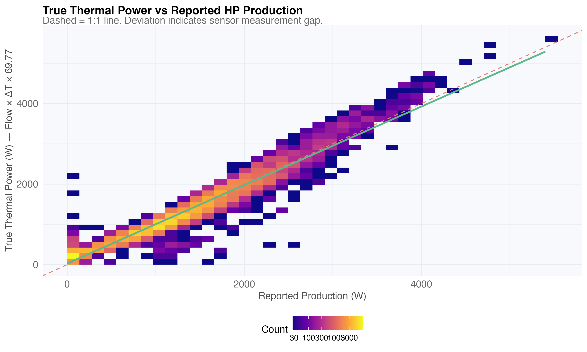
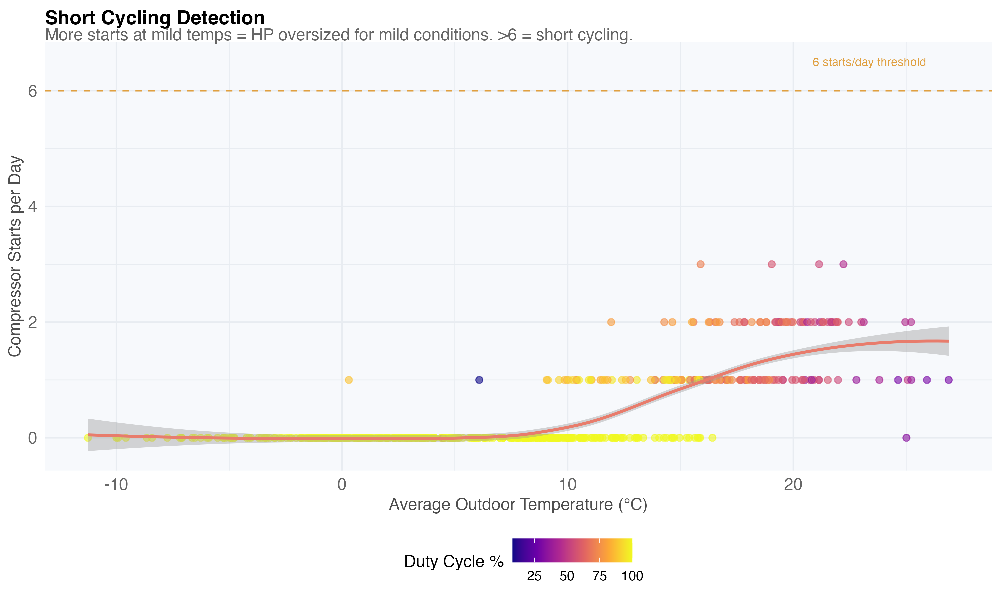
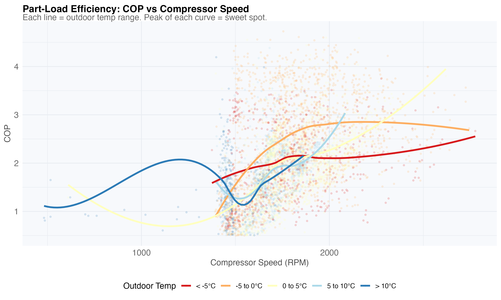
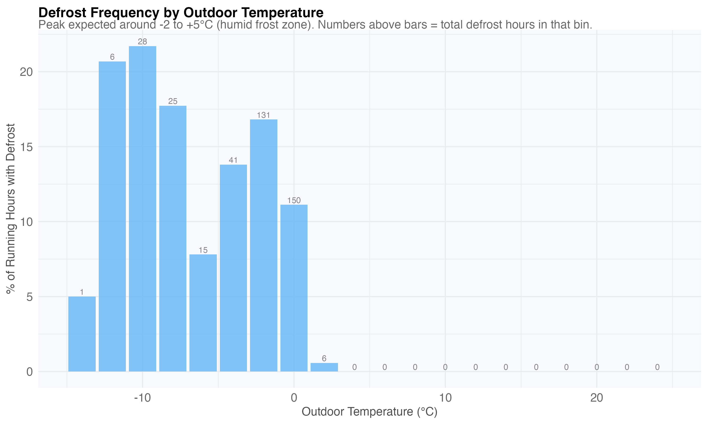
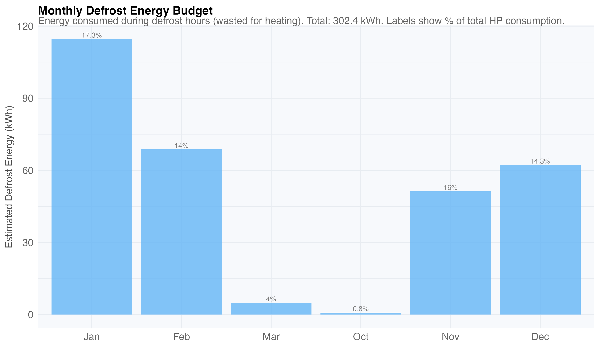

# Part III — Heat Pump Performance

Diagnosing the air-source heat pump: COP drivers, compressor behavior,
defrost overhead, and weather effects.

## COP vs Outdoor Temperature

COP depends heavily on outdoor temperature. Below 0°C, efficiency drops sharply:

COP varies by time of day (morning defrost periods vs afternoon):

## Temperature Lift

The water temperature lift (outlet - inlet) directly determines efficiency.
DHW cycles require much higher lifts (40-50°C vs 5-10°C for heating):

## Compressor Diagnostics

Lower compressor speeds achieve higher COP — part-load efficiency matters:

True thermal power (flow × ΔT) vs reported sensor — measurement accuracy check:

Refrigerant cycle (discharge temperature vs high pressure, colored by COP):

## Cycling & Modulation

Compressor speed distribution — smooth modulation or excessive on/off?

Short cycling detection — too many transitions per day waste energy:

The part-load sweet spot — COP vs compressor speed at different outdoor temps:

## Defrost Energy Budget

Defrost cycles reverse the refrigerant to melt ice from the outdoor evaporator.
They produce zero useful heat — pure overhead.

Frequency increases sharply below -5°C, consuming 14-17% of winter HP energy:

Monthly defrost energy as fraction of total HP consumption:

Pipe temperature during a defrost event:

## Wind Chill Effect

Wind strips heat from the evaporator coil, reducing COP measurably:

Certain wind directions expose more building surface or the outdoor unit:

HP works harder in windy conditions at the same outdoor temperature:

