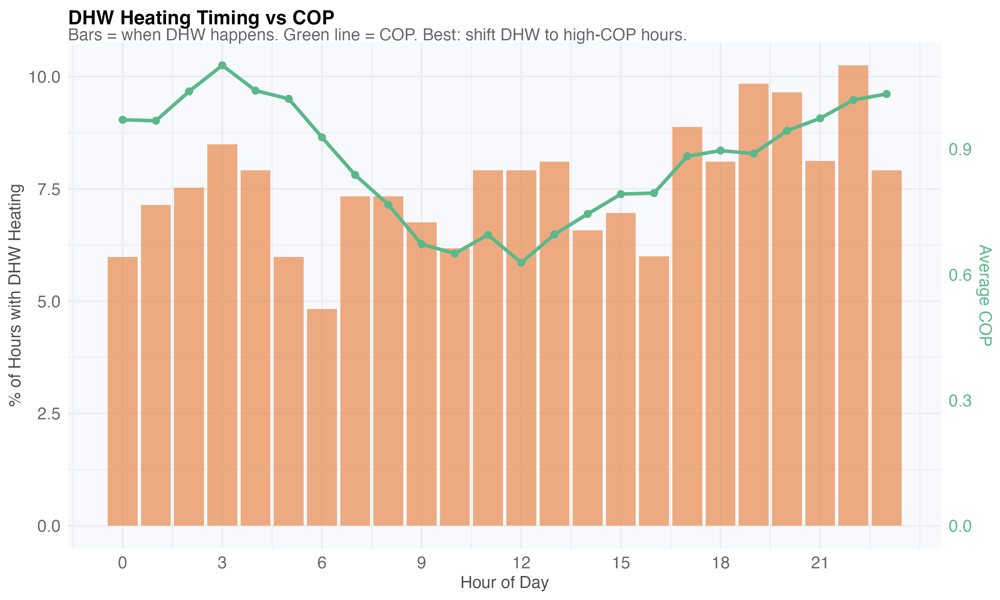
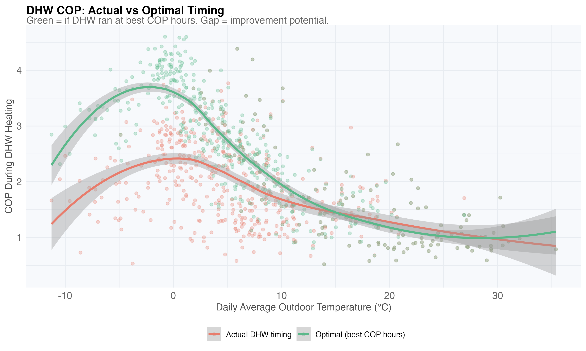
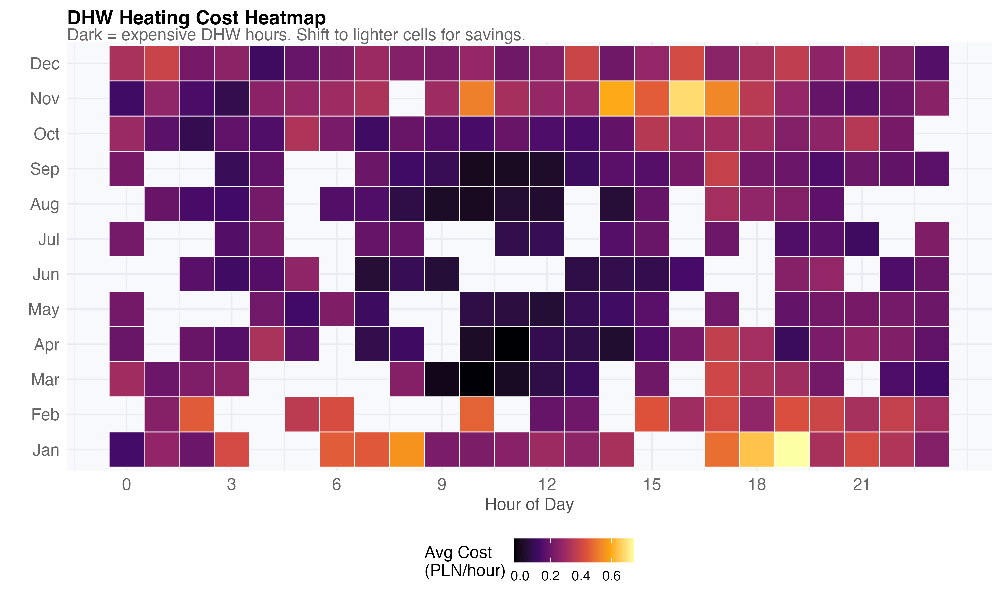
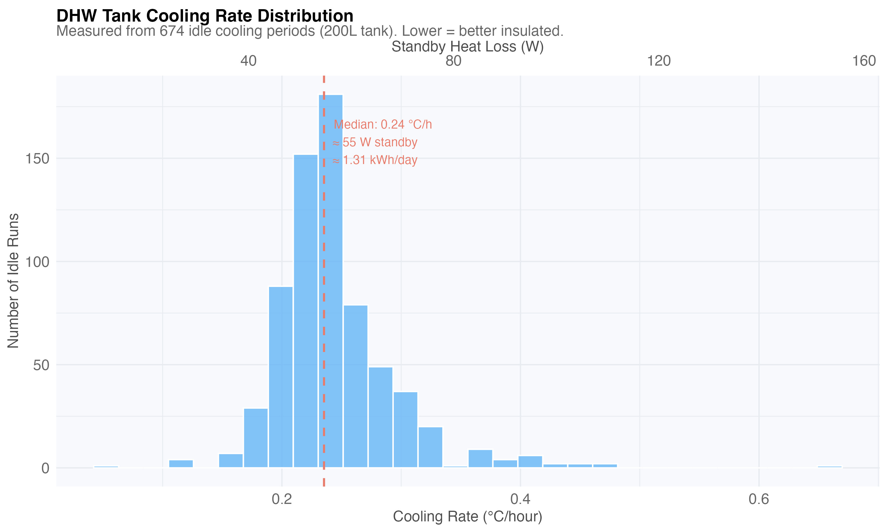

# Part IV — Domestic Hot Water

DHW heating is the least efficient HP mode (high temperature lift) and the
tank loses heat continuously. Two opportunities: better timing and less loss.

## DHW Timing Optimization

When does DHW heating happen vs when COP is highest? Misalignment wastes energy:

COP improvement potential — actual timing vs optimal scheduling:

Cost by hour and month — dark cells are the most expensive times:

## Tank Standby Loss

Exponential decay model fit to idle cooling periods: τ ≈ 105 hours, steady
standby loss ≈ 55W. Annual cost: ~384 PLN.

How long until the tank reaches 40°C from different starting temperatures:

