# Part V — Building Envelope & Heating

Understanding the thermal performance of the building: which rooms hold heat,
where the heating curve is wrong, and what temperature changes would save.

## Heating Curve Audit

The HP uses a weather-compensating curve: outdoor temperature → target water
supply temperature. A wrong curve wastes energy.

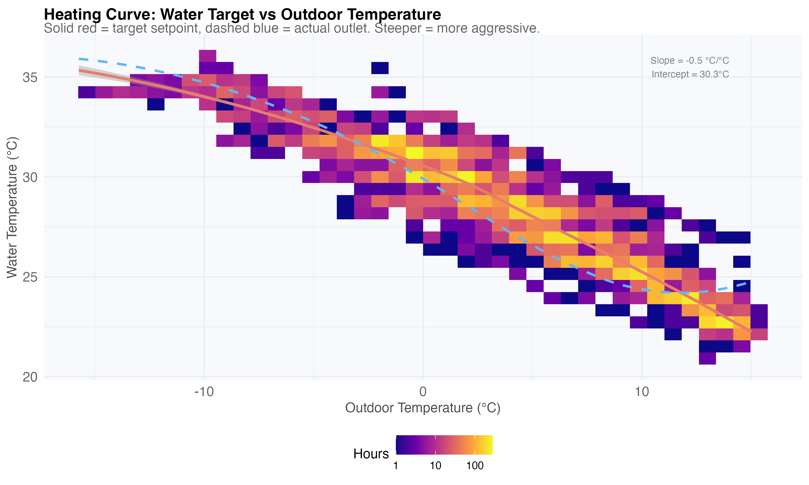

Room temperatures by outdoor bin reveal over- or under-heating:

Where is the curve wrong? Red = overheating, blue = insufficient:

COP penalty for each unnecessary degree of water temperature:

## Indoor Temperature Stability

Room-by-room comparison — which rooms are warmer, cooler, more stable:

Daily temperature swing per room:

## Room Thermal Response

Cooling rate when the HP cycles off — a direct measure of insulation and
thermal mass per room:

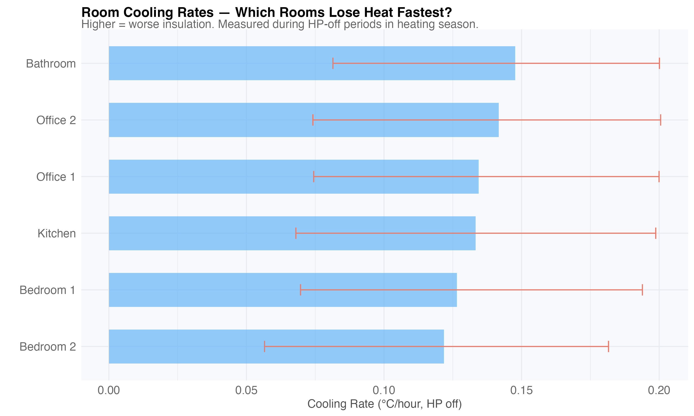

Thermal inertia ranking — hours to lose 1°C:

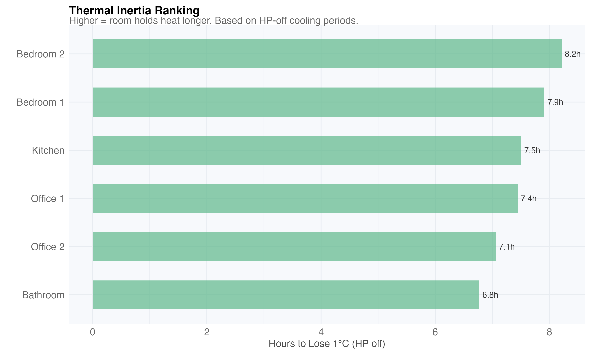

Overnight temperature drop (22:00 → 06:00):

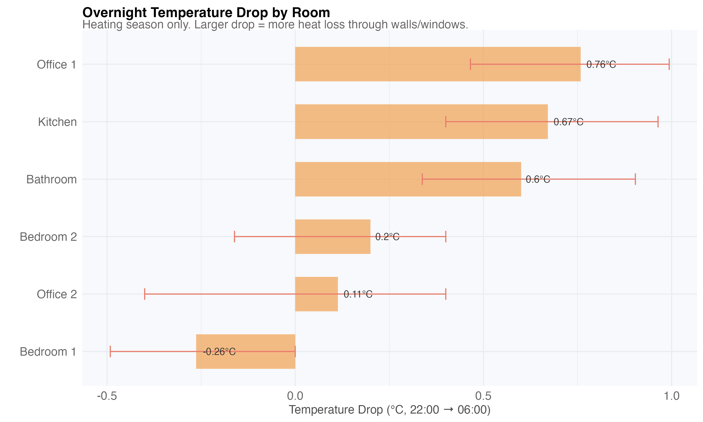

Temperature uniformity across rooms — wide spread means zoning problems:

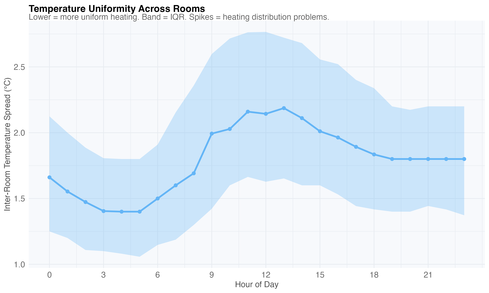

## Floor Temperature Differences

Ground floor (living room, kitchen, Olek, Beata) vs first floor/attic
(bathroom, bedrooms). First floor averages 0.5°C cooler:

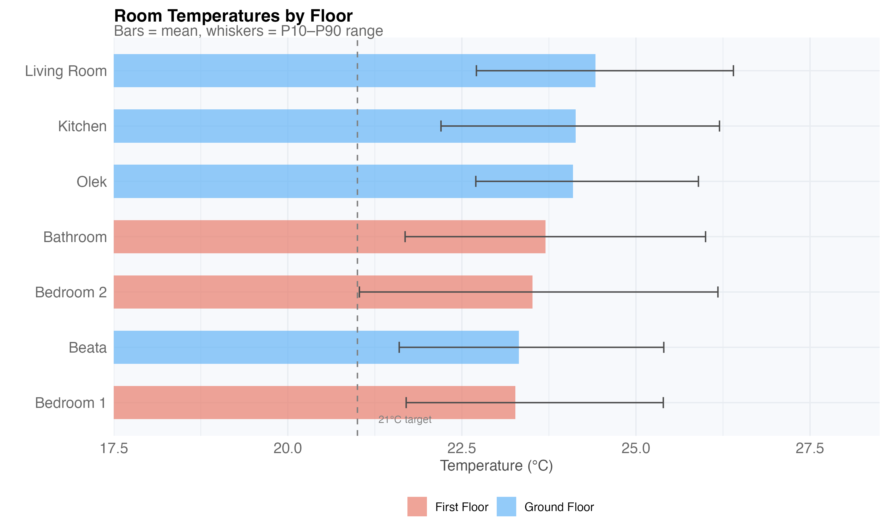

Monthly temperature difference between floors:

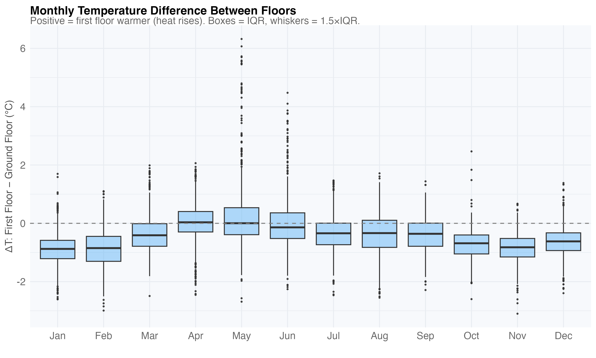

Hourly floor temperature profiles — ground floor runs consistently warmer:

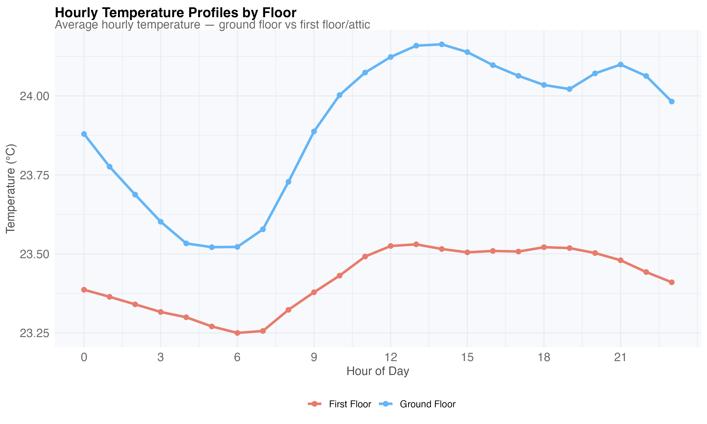

Hourly difference pattern (first floor − ground floor):

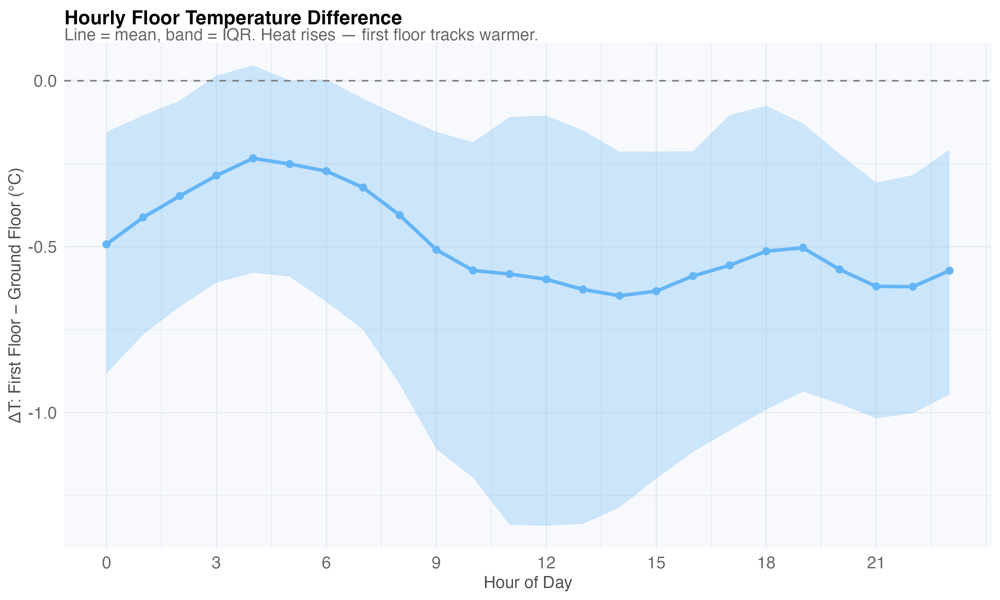

## Heating Curve Impact on Floor Temperatures

How sensitive is each room to supply water temperature changes? Linear model
controls for outdoor temperature:

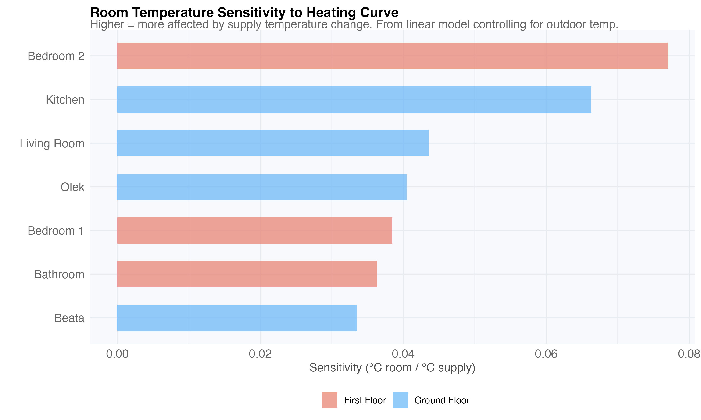

Predicted temperature drop at different curve reductions, by floor:

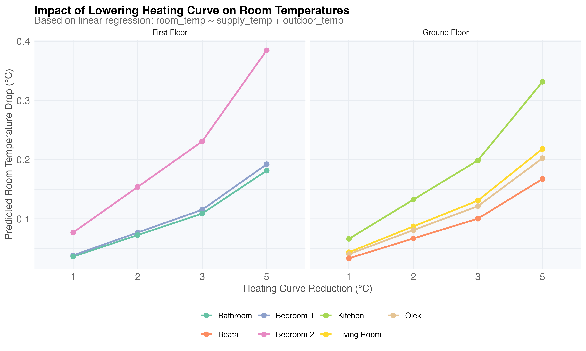

Floor-level comparison — which floor hits comfort limits first:

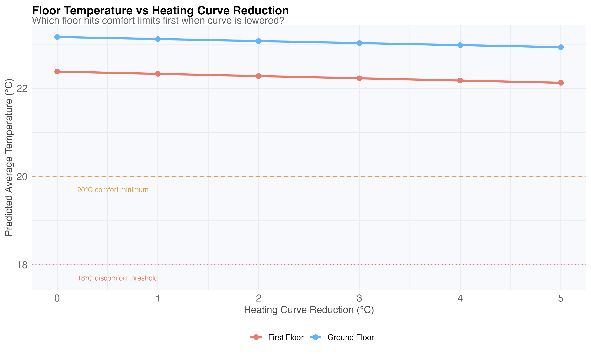

Cold risk — percentage of heating hours below 20°C at each reduction:

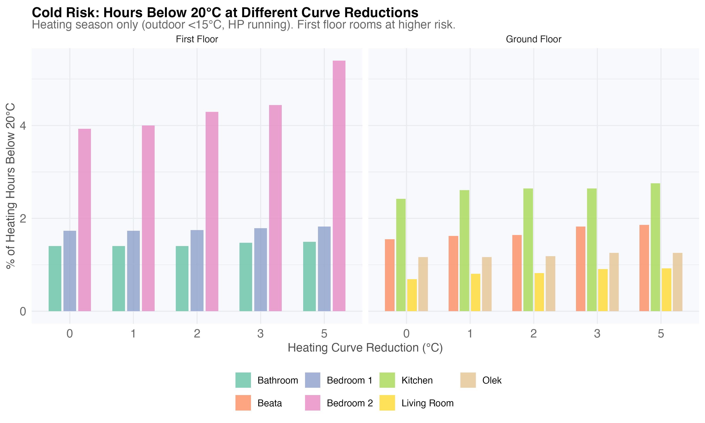

## Workshop Thermal Response

The unheated workshop follows outdoor conditions closely:

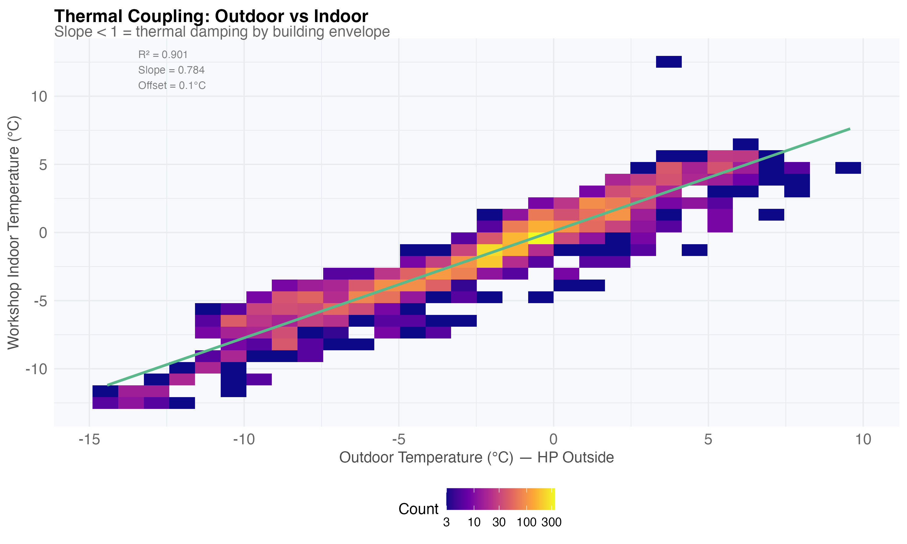

Thermal lag — hours for outdoor changes to propagate:

## Heating Savings & Cooling Projections

Energy contributed by each outdoor temperature bin:

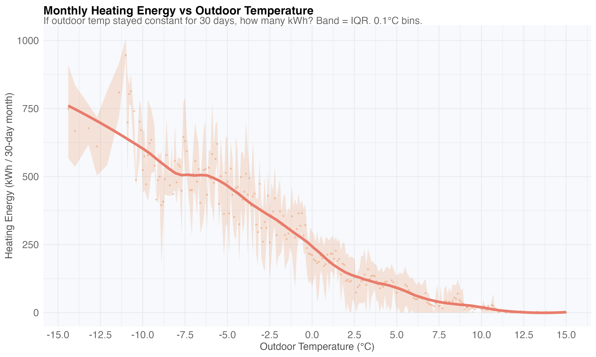

Weekly savings from reducing indoor temperature (-1°C, -2°C, -3°C, max 21°C):

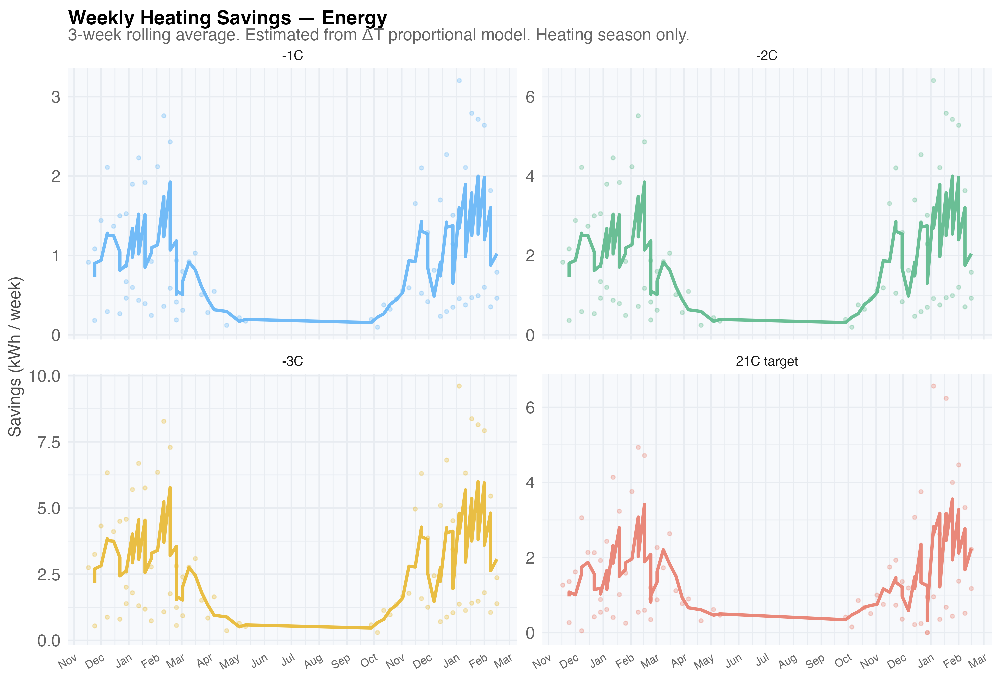

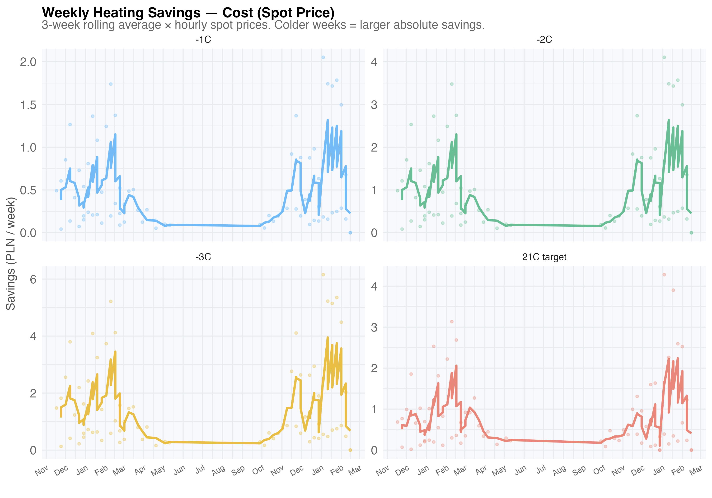

Estimated cooling energy for summer. Right panel: impact of +4°C European warming:

