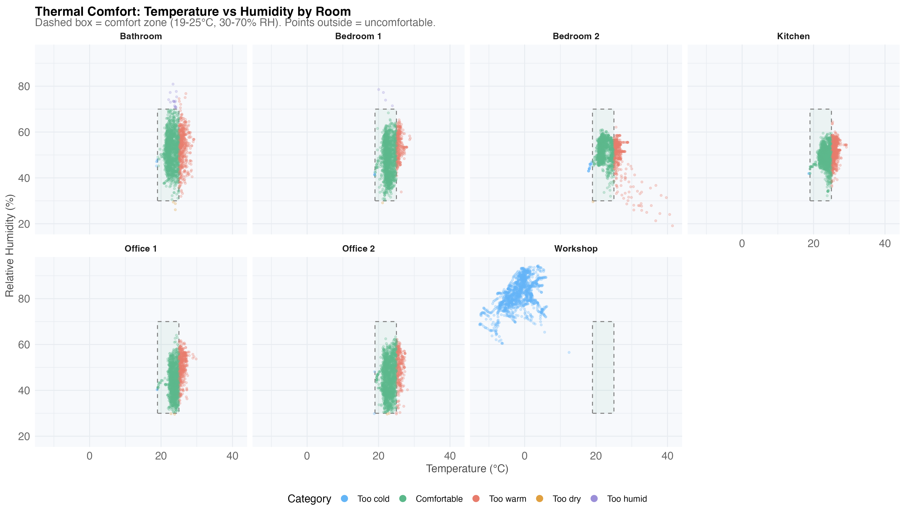
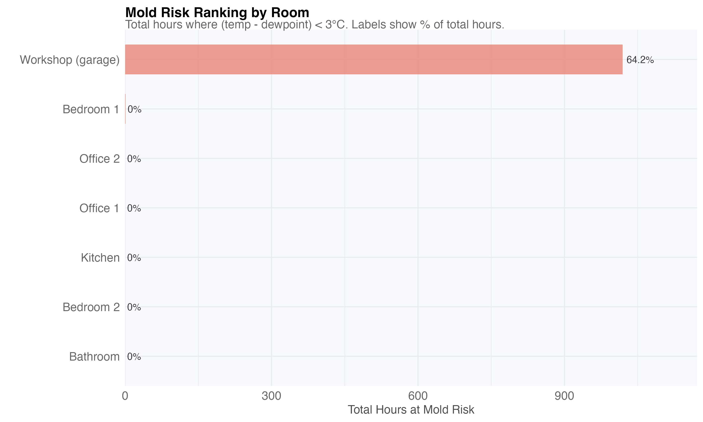
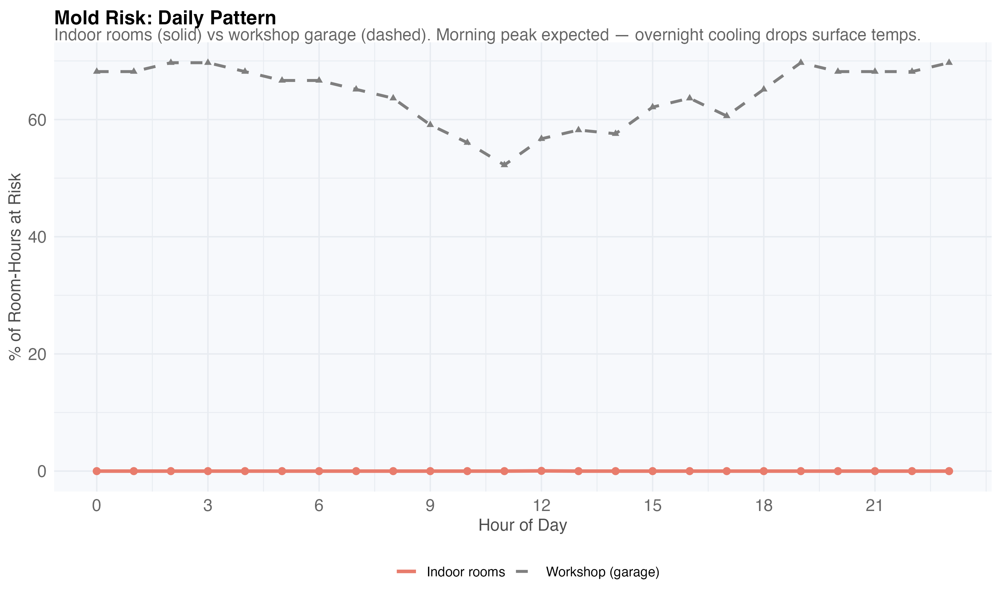
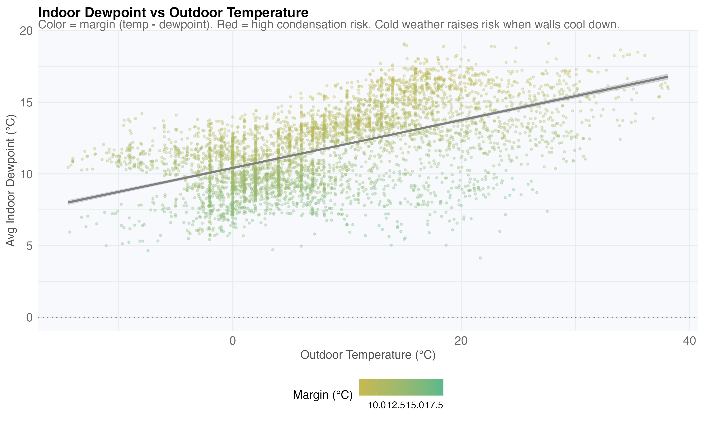
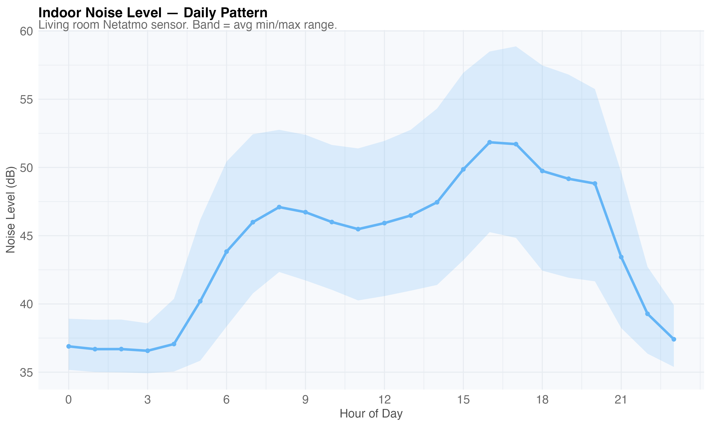

# Part VI — Indoor Climate

Comfort, moisture, and air quality across all monitored rooms.

## Thermal Comfort (ASHRAE)

ASHRAE Standard 55 comfort zone: 19-25°C, 30-70% RH. The dominant discomfort
mode is overheating (21% of room-hours), not cold (3%):

## Mold Risk

Dewpoint proximity analysis using the Magnus formula. All living spaces show
zero risk. The workshop (unheated garage, 82% RH) has 64% of hours at risk —
relevant for stored electronics and tools:

## Air Quality

CO2 by room reveals occupancy — bedroom peaks at night, living room in evening:

Noise levels track daily activity patterns:

