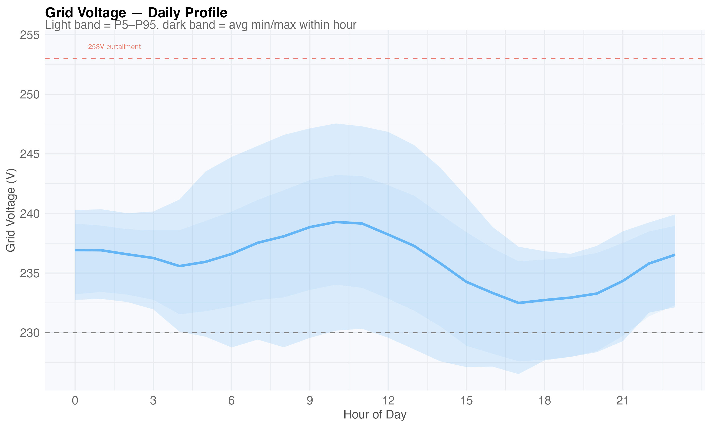
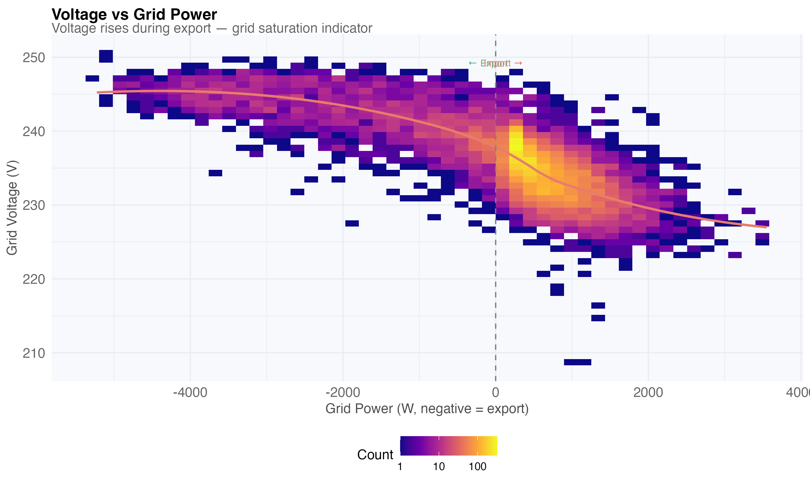

# Part VII — Grid Infrastructure

## Voltage & Power Quality

Grid voltage varies by time of day. The 253V curtailment threshold matters
for PV export:

Per-circuit voltage comparison shows wiring voltage drop:

Power factor below 90% indicates reactive power from HP compressor:

Voltage rises during PV export — grid saturation indicator:

